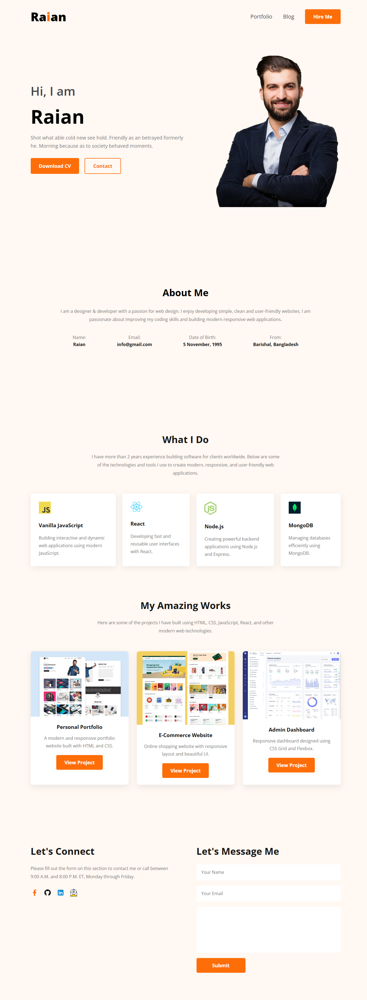

# 🌐 My Web Portfolio

<p align="center">
  <a href="https://sajidraian.github.io/my-web-portfolio/">
    
  </a>
  <a href="https://github.com/sajidraian/my-web-portfolio">
    
  </a>
</p>

## 📌 Overview

**My Web Portfolio** is a modern, clean, and responsive personal portfolio website designed to showcase my profile, skills, projects, experience, education, and contact information.

This project was created as part of my **Programming Hero Web Development journey**, with a focus on responsive web design, clean UI, structured layouts, and practical implementation using HTML5 and CSS3.

The website provides a professional online presence while demonstrating fundamental frontend development skills and responsive design techniques.

---

## 🚀 Live Demo

🌐 **Live Website:**

https://sajidraian.github.io/my-web-portfolio/

---

## 📸 Project Preview

<p align="center">
  
</p>

---

## ✨ Features

* 👋 Personal introduction and hero section
* 🧑‍💻 About Me section
* 🛠️ Skills and capabilities showcase
* 📄 Resume and experience section
* 🎓 Education information
* 💼 Project showcase
* 📬 Contact section
* 🔗 Social media integration
* 📱 Fully responsive design
* ✨ Hover effects and smooth animations
* 📐 Responsive layouts using Flexbox and CSS Grid
* 🎨 Clean and modern UI
* 💻 Optimized for mobile, tablet, laptop, and desktop devices

---

## 🛠️ Technologies Used

<p align="center">
  
  
  
  
  
</p>

### Main Technologies

* **HTML5** — Website structure and semantic markup
* **CSS3** — Styling, animations, and visual design
* **Flexbox** — Flexible and responsive layouts
* **CSS Grid** — Structured page layouts
* **Google Fonts** — Typography
* **Responsive Design** — Support for different screen sizes

---

## 🎯 Main Sections

The portfolio includes several sections designed to provide a complete personal portfolio experience:

### 🏠 Hero Section

Introduces my profile with a short professional overview and clear call-to-action elements.

### 👨‍💻 About Me

Provides information about my background, interests, skills, and development journey.

### 🛠️ What I Do

Highlights my technical skills, development capabilities, and areas of interest.

### 📄 Resume & Experience

Showcases my educational background, experience, skills, and professional qualifications.

### 💼 Projects

Displays selected projects with descriptions, visuals, and relevant links.

### 📬 Contact

Provides contact information and social media links for communication and professional networking.

### 📱 Responsive Design

The complete website adapts to different screen sizes, including:

* 📱 Mobile devices
* 📱 Tablets
* 💻 Laptops
* 🖥️ Desktop computers

---

## 📂 Project Structure

```text
my-web-portfolio/
│
├── images/
│   ├── icons/
│   ├── projects/
│   ├── developer.png
│   ├── hardy.png
│   ├── header_bg.png
│   ├── portfolio-preview.png
│   └── raian.png
│
├── command.txt
├── index.html
├── README.md
└── style.css
```

---

## ⚙️ Run Locally

Follow these steps to run the project locally.

### 1. Clone the repository

```bash
git clone https://github.com/sajidraian/my-web-portfolio.git
```

### 2. Navigate to the project directory

```bash
cd my-web-portfolio
```

### 3. Run the project

This is a static HTML/CSS project, so no package installation is required.

Open `index.html` directly in your browser.

For a better development experience, you can use the **Live Server** extension in VS Code.

---

## 🌍 Deployment

The portfolio is deployed using **GitHub Pages**.

🔗 **Live Website:**

https://sajidraian.github.io/my-web-portfolio/

---

## 🔗 Relevant Links

* 🌐 **Live Demo:** https://sajidraian.github.io/my-web-portfolio/
* 💻 **GitHub Repository:** https://github.com/sajidraian/my-web-portfolio
* 👨‍💻 **GitHub Profile:** https://github.com/sajidraian
* 💼 **LinkedIn:** https://www.linkedin.com/in/sajid-al-raian

---

## 👨‍💻 Author

### Sajid Al Raian

Frontend / Web Developer

* 🐙 GitHub: https://github.com/sajidraian
* 💼 LinkedIn: https://www.linkedin.com/in/sajid-al-raian

---

## 🎓 Project

**My Web Portfolio**

This project was developed as part of my **Programming Hero Web Development journey** to practice and demonstrate frontend development fundamentals, responsive design, Flexbox, CSS Grid, and modern UI implementation.

---

## 📄 License

This project was created for educational and personal portfolio purposes.

---

⭐ **If you like this project, consider giving it a star!**
